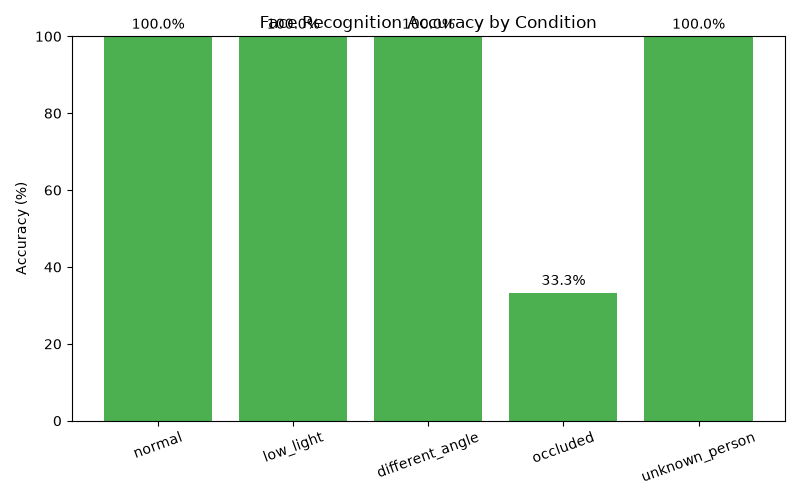
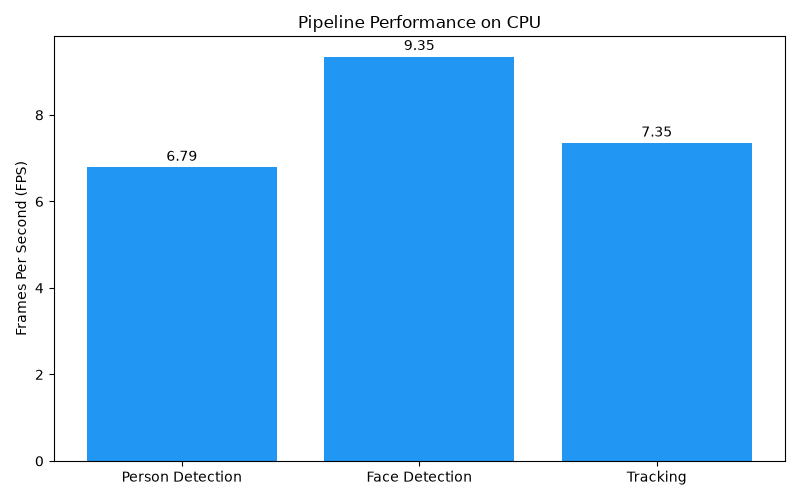

# Smart Campus AI — Real-Time Intelligent Surveillance & Access System

An end-to-end AI perception pipeline that detects people, recognizes faces, tracks identities across frames, and logs entry/exit events in real time — built from scratch with YOLOv8, DeepFace, PostgreSQL, FastAPI, and React.

This is not just a face recognition demo. It is a full system architecture: **camera → detection → recognition → database → tracking → API → live dashboard**, backed by structured evaluation of accuracy, latency, and robustness under real-world conditions — including an iterative optimization process that improved recognition accuracy from 66.7% to 86.7%.

## What's in the app

- **Landing page:** product overview with the measured evaluation results
- **Live dashboard (admin):** camera feed with detection overlays, foot-traffic chart, and a filterable, searchable event log streamed over WebSocket
- **Directory (admin):** students, staff, classes and visitors, with add/edit dialogs, search and filters
- **Visitor management (admin):** check-in with an allowed duration, live countdown, and overstay highlighting
- **My class (teacher):** class roster and the class's recent entries and exits
- **My profile (student):** the student's own entry/exit timeline
- **Sign-in:** username and password, or fingerprint / Windows Hello (WebAuthn); light and dark themes

## Architecture

```
RTSP/Webcam Feed
      |
YOLOv8 Person Detection
      |
YOLOv8-Face Face Detection
      |
DeepFace Recognition (MTCNN detector, Facenet512 embeddings, RetinaFace fallback)
      |
PostgreSQL Student Lookup
      |
ByteTrack Entry/Exit Tracking
      |
FastAPI Backend (REST + WebSocket)
      |
React Real-Time Dashboard
```

## Features

- **Person detection** — YOLOv8n, real-time on CPU
- **Face detection** — YOLOv8n-face (purpose-trained) for the standalone detection module; MTCNN with RetinaFace fallback for the recognition pipeline
- **Face recognition** — DeepFace embeddings (Facenet512) with face alignment, matched against a known-faces reference database
- **Student identification** — recognized faces resolved to real student records via PostgreSQL
- **Entry/exit tracking** — persistent IDs across frames using ByteTrack, with timestamped event logging
- **Event history in PostgreSQL** — every entry, exit, crowd alert and possible fall is stored (who, when, camera, recognition confidence) by a background writer, so the camera loop never waits for the database; the dashboard and the teacher/student timelines page back through the full history
- **Crowd detection** — threshold-based alerts when occupancy exceeds a configurable limit, with cooldown to prevent alert spam
- **Fall detection** — flags a possible fall when a tracked person's bounding box changes sharply from tall to wide (heuristic, not a trained model)
- **Role-based access** — admin, teacher and student accounts, bcrypt-hashed passwords, and admin-only write endpoints
- **Fingerprint / Windows Hello sign-in** — WebAuthn passkeys registered per device
- **Visitor, staff and class management** — directory data the recognition pipeline and dashboards use
- **REST + WebSocket API** — FastAPI backend exposing live recognition/tracking events, pushed in real time (not polled)
- **Real-time dashboard** — React interface with a shared design system, live stat cards, traffic chart, event log, responsive layout and light/dark themes
- **Landing page** — product-style marketing page with feature highlights and evaluation stats
- **Evaluation suite** — accuracy, FAR/FRR, and FPS benchmarking with automated chart generation

## Tech Stack

| Layer | Technology |
|---|---|
| Detection | YOLOv8 (Ultralytics) |
| Face Recognition | DeepFace — MTCNN detector, Facenet512 embeddings, RetinaFace fallback |
| Tracking | ByteTrack |
| Database | PostgreSQL |
| Backend | FastAPI, Uvicorn, WebSockets, bcrypt, WebAuthn |
| Frontend | React 19 (Vite), Tailwind CSS v4, Recharts, React Router, Lucide icons |
| Language | Python 3.11, JavaScript |
| Environment | CPU-only (no dedicated GPU) |

## Evaluation Results

### Recognition Accuracy — Iterative Improvement

The system was evaluated across 5 real-world conditions (3 held-out test images each, not present in the reference set), then iteratively improved based on the results:

| Stage | Configuration | Overall Accuracy | FRR | FAR |
|---|---|---|---|---|
| Baseline | 3 reference photos, OpenCV (Haar Cascade) + VGG-Face | 66.7% | 41.7% | 0.0% |
| Iteration 1 | 15 reference photos, MTCNN + Facenet512 + alignment | 73.3% | 33.3% | 0.0% |
| **Final** | **22 reference photos, MTCNN + Facenet512 + alignment + RetinaFace fallback** | **86.7%** | **16.7%** | **0.0%** |



| Condition (Final Configuration) | Accuracy |
|---|---|
| Low light | 100.0% |
| Normal / frontal | 100.0% |
| Different angle | 100.0% |
| Unknown person (correct rejection) | 100.0% |
| Occluded | 33.3% |

**False Acceptance Rate (FAR): 0.0%** across every iteration — the system never misidentified a stranger as a known student, throughout the entire optimization process.

**Interpretation:** Expanding the reference dataset from 3 to 22 photos, combined with upgrading from Haar Cascade + VGG-Face to MTCNN + Facenet512 with face alignment, improved overall accuracy by 20 percentage points while maintaining a perfect false-acceptance record. Different-angle recognition improved from 33.3% to 100%. Partial occlusion remains the primary limitation: landmark-based detectors (MTCNN, and RetinaFace as a tested fallback) require visible facial landmarks (eyes, nose, mouth) to function, and fail at the detection stage — before recognition is even attempted — when occlusion is severe enough to obscure multiple landmarks simultaneously. This is a documented, tested boundary rather than an unexamined weakness.

### Pipeline Performance (FPS, CPU-only)



| Stage | FPS | Avg Latency |
|---|---|---|
| Person Detection (YOLOv8n) | 6.79 | 147.3 ms |
| Face Detection (YOLOv8n-face) | 9.35 | 106.9 ms |
| Tracking (YOLOv8n + ByteTrack) | 7.35 | 136.1 ms |

All benchmarks were run on integrated (non-dedicated) CPU graphics. Real-time performance (30+ FPS) would require GPU acceleration; current throughput is sufficient for near-real-time entry logging but not high-frame-rate video analytics. Recognition latency (MTCNN + Facenet512, per image) averages ~2.6s on CPU after model warm-up.

## Project Structure

```
smart-campus-ai/
├── backend/
│   ├── detection/       # YOLO person and face detection
│   ├── recognition/     # DeepFace recognition logic
│   ├── tracking/        # ByteTrack + entry/exit/crowd detection engine
│   ├── api/             # FastAPI application (REST + WebSocket)
│   └── database/        # schema.sql, seed.sql (fictional demo data), create_user.py
├── frontend/
│   ├── src/
│   │   ├── pages/       # One file per screen (dashboard, students, visitors, login, ...)
│   │   ├── components/
│   │   │   ├── ui/        # Design system: buttons, fields, dialogs, badges, tables, toasts
│   │   │   ├── layout/    # App shell: role-aware sidebar and mobile menu
│   │   │   └── dashboard/ # Camera feed, traffic chart, event log
│   │   ├── lib/         # API client, session, theme, live events, formatting
│   │   ├── App.jsx      # Routes (signed-in pages load on demand)
│   │   └── main.jsx     # Entry point
├── data/
│   ├── known_faces/     # Reference photos per identity (local only, not in git)
│   └── test_images/     # Held-out evaluation test set, 5 conditions (local only)
├── evaluation/           # Benchmark scripts, results, charts
└── README.md
```

## Setup

From a fresh clone to a running system. Commands are for Windows (PowerShell); on macOS/Linux use `source venv/bin/activate` and `/` paths.

### 1. Prerequisites
- Python 3.11
- Node.js 18+
- PostgreSQL 13+ (developed on 18), with `psql` on your PATH
- A webcam (for the live pipeline)

### 2. Python environment
```bash
python -m venv venv
venv\Scripts\activate
pip install -r requirements.txt
```

### 3. Database
Create the database, the tables and (optionally) some demo data with fictional people:
```bash
createdb -U postgres smart_campus_db
psql -U postgres -d smart_campus_db -f backend/database/schema.sql
psql -U postgres -d smart_campus_db -f backend/database/seed.sql     # optional
```

**Upgrading an existing database?** Run the migrations once, in order. Both are safe to re-run.
- `001` links accounts to people by ID instead of by name. It links every account whose full name matches exactly one student or staff member, then lists any accounts left to link by hand.
- `002` creates the `events` table that stores the event history.
```bash
psql -U postgres -d smart_campus_db -f backend/database/migrations/001_link_users_to_people.sql
psql -U postgres -d smart_campus_db -f backend/database/migrations/002_events_table.sql
```

### 4. Configuration
Copy `.env.example` to `.env` in the project root and set your database password. `.env` is ignored by git. The same file sets the session length (`SESSION_HOURS`), the dashboard address used for CORS and fingerprint sign-in (`FRONTEND_ORIGIN`, `WEBAUTHN_RP_ID`) and the camera (`CAMERA_SOURCE`: a webcam index or an `rtsp://` URL; `CAMERA_NAME` labels its events); the defaults suit local development.

### 5. An admin account
```bash
python backend/database/create_user.py
```
Choose the `admin` role. Teacher and student accounts are linked to a person: the script asks for the student's roll number, or the teacher's staff record. With the seed data, a teacher account linked to staff record 1 ("Demo Teacher One") sees Grade 9 - A.

### 6. Models and face photos
- `yolov8n.pt` (person detection) downloads automatically on first run.
- A YOLOv8 face-detection model must be placed at `backend/detection/models/yolov8n-face.pt`. Model files (`*.pt`) aren't stored in git.
- Add reference photos for the people to recognize, as described in [data/README.md](data/README.md). Face images are never committed, so a fresh clone starts with none.

### 7. Run
```bash
uvicorn backend.api.main:app --reload          # API on http://localhost:8000
```
```bash
cd frontend
npm install
npm run dev                                    # dashboard on http://localhost:5173
```

The dashboard talks to `http://localhost:8000` by default. To use another backend, copy `frontend/.env.example` to `frontend/.env` and set `VITE_API_URL`.

Open http://localhost:5173 and sign in. Admins land on the live dashboard, teachers on their class, students on their own profile. Sessions last 8 hours (`SESSION_HOURS` in `.env`).

## Running tests

**Backend** (pytest, 112 tests): sign-in and session expiry, 401/403 on every protected endpoint, stream tickets, create/edit/delete for students, staff, classes and visitors, the database schema and seed data, ID-based event matching, and event storage (background writes that never block, outage recovery, per-role reads and pagination).
```bash
pip install -r requirements-dev.txt
python -m pytest tests
```
- No webcam, face model or real database is used. The camera/recognition engine is replaced by a fake, and each run creates a throwaway PostgreSQL cluster in a temp folder with `initdb`, loads `schema.sql` and deletes it afterwards. Your own database is never touched.
- The PostgreSQL command-line tools must be installed. They're found on your PATH, in `C:\Program Files\PostgreSQL\*\bin`, or via the `PG_BIN` environment variable. To use an existing empty database instead, set `TEST_DB_HOST`, `TEST_DB_PORT`, `TEST_DB_NAME`, `TEST_DB_USER` and `TEST_DB_PASSWORD`.

**Frontend** (Vitest + Testing Library, 10 tests): the login page, route protection by role and session expiry, a list page's error state, the API client's auth header and 401 handling, and loading older history.
```bash
cd frontend
npm test
```

## Known Limitations

- Partial occlusion remains challenging for landmark-based detectors (MTCNN, RetinaFace); severe occlusion covering multiple landmarks causes detection failure upstream of recognition
- Tracker IDs are not persistent across full disappearances from frame — a person leaving and re-entering is assigned a new ID (no long-term re-identification yet)
- CPU-only inference limits throughput to under 10 FPS per detection stage; recognition adds ~2.6s latency per face
- Evaluation dataset is intentionally small (15 held-out test images) for rapid iteration; results are indicative and methodologically sound but not statistically exhaustive
- Crowd detection uses a simple frame-count threshold rather than density-aware spatial analysis
- Sessions are held in server memory, so restarting the backend signs everyone out

## Future Work

- Add long-term re-identification to preserve identity across full frame absences
- GPU deployment for real-time throughput (30+ FPS)
- Expand evaluation dataset for statistically robust metrics; add precision/recall/mAP for the detection stage specifically
- Add pose-based behavior/activity recognition (per original project scope)
- Density-aware crowd analysis rather than simple headcount thresholding
- Public deployment with browser-based camera access for live demonstration

## Author

Aziz Ahmad — Final Year Project
[GitHub](https://github.com/Aziz-ahmad555/smart-campus-ai)
